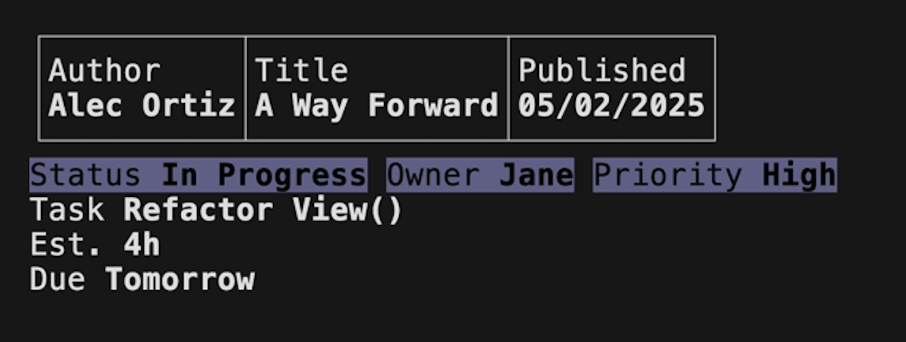

Sure! Here's a fun, Charm-style README for your `metric` package, with a balance of charm and clarity:

---

# 🧮 `metric` – Tiny Text Metrics, Beautifully Displayed

*A delightful way to render key-value metrics in your TUI, one line at a time.*

Inspired by the elegance of [Charm](https://charm.sh) tools and the expressive power of `lipgloss`, `metric` lets you compose tiny text widgets like stats, tags, or info blocks with rich styles and direction-aware layouts.

---

## ✨ Features

* 📐 Horizontal or vertical stacking
* 🎨 Multiple layout presets (card, tag, list)
* ✂️ Gaps or smart borders
* 🔁 Dynamic updates to metric values
* 🧩 Extendable and composable

---

## 🚀 Getting Started

```go
import "github.com/yourname/bubbles/metric"
```

### Basic Setup

```go
m := metric.New(
    metric.WithMetrics([]metric.Metric{
        {Title: "Author", Value: "Alec Ortiz"},
        {Title: "Published", Value: "05/02/2025"},
        {Title: "Title", Value: "A Way Forward"},
    }),
)
```

Render it in your Bubbletea `View()` like this:

```go
func (m model) View() string {
    return m.metric.View()
}
```

---

## 🧩 Options

### 🧱 `WithMetrics(metrics []Metric)`

Define the title/value blocks to show.

---

### 🎨 `WithLayout(layout Layout)`

Use one of the built-in layouts:

```go
metric.CardLayout // stacked title and value
metric.TagLayout  // colored inline tags
metric.ListLayout // simple list-style
```

---

### ↔️ `WithDirection(metric.Horizontal | metric.Vertical)`

Stack metrics **horizontally** like tags or **vertically** like cards.

---

### 🖼️ `WithBorder(true)`

Wraps each metric with an intelligent, connected border. Looks great in a list.

---

### 🧷 `WithGap(n int)`

Add spacing between metrics when borders are off. Good for padding out lists.

---

## ⚡ Live Updates

You can update metrics dynamically:

```go
msg := metric.UpdateValueMsg{Index: 1, Value: "Updated!"}
```

Handle it inside your model's `Update()`:

```go
case metric.UpdateValueMsg:
    m.metric, _ = m.metric.Update(msg)
```

---

## 🧙 Advanced: Custom Layouts

You’re not stuck with presets! You can roll your own `Layout` to control how the title and value are styled and stacked.

```go
myLayout := metric.Layout{
    Title: lipgloss.NewStyle().
        Foreground(lipgloss.Color("#ff79c6")).
        Bold(true),
    Value: lipgloss.NewStyle().
        Foreground(lipgloss.Color("#bd93f9")),
    Direction: metric.Horizontal,
}

m := metric.New(
    metric.WithLayout(myLayout),
    metric.WithMetrics([]metric.Metric{
        {Title: "Magic", Value: "42"},
        {Title: "Luck", Value: "7"},
    }),
    metric.WithDirection(metric.Vertical),
    metric.WithBorder(true),
)
```

Go wild. It’s just `lipgloss` under the hood.

---

## 📸 Screenshots



---

## 💌 Credits

Built with love by [Alec Ortiz](https://github.com/ortizalec), powered by `lipgloss` and `bubbletea`.

---

## 🪄 License

MIT. Do what you will, but please keep it magical.

---

Let me know if you'd like to include example screenshots, badges, or a code playground!
